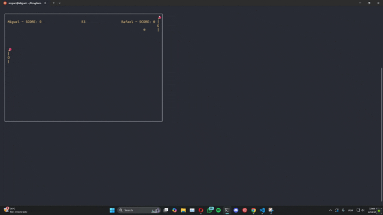

 

 
 
 

## 🖥️ PongShowdown

## 📄 Description

PongShowdown is a game based on Pong (1972), the first game in history, which has two paddles on opposite sides of the screen, one for each player. The objective of the game is to hit the ball and hit the opposite wall, scoring a point.

## 🤠 Wild West Duels
PongShowdown also brings a new feature: after a certain amount of play time, Showdown mode begins, where the players' objective changes from hitting the ball to hitting the opponent's paddle with "bullets," which can be launched with the "A" key (Player 1) or the "L" key (Player 2). The scores for hits on the wall and the number of times the opponent is hit will be added up and recorded in a ranking, which can be accessed on the home page.

## 🕹️ How to Play

- Player 1 can use "W" and "S" to control the paddles on the left side. Press "A" in Showdown mode to shoot.

- Player 2 can use the "I" and "J" keys to control the paddles on the right side. Press "L" in Showdown mode to shoot.

- Make sure to keep Caps Lock off.

- Keep your paddles moving to hit the balls and score points.

- When Showdown mode starts, shoot your opponent to score points.

## ♟️ Running the Game

To run PongShowdown, follow these steps:

1. Clone this repository to your machine:

git clone https://github.com/MigueldsBatista/PongGame.git

2. Compile and run the program:

Execute the commands:

<strong>

 ➮ cd PongGame

 ➮ ./exec.sh

</strong>
3. Have fun playing PongShowdown with your friends!

## 👩‍💻 Members

<ul> 
<li> 
<a href="https://github.com/raf7525">Rafael Barros</a> - 
ralb@cesar.school 📩 
</li> 
<li> 
<a href="https://github.com/MigueldsBatista">Miguel Batista </a> - 
msb2@cesar.school 📩 
</li> 
<li> 
<a href="https://github.com/ticogafa">Tiago Gurgel</a> - 
tgafa@cesar.school 📩 
</li>
</ul>

## License

<a href="https://github.com/MigueldsBatista/PongGame/blob/main/LICENSE">License</a>
